# SDN-Path-Tracing-Mininet-CN_orange

## SDN-Based Path Tracing Tool using Mininet and POX

---

## 📌 Problem Statement

Design and implement a Software Defined Networking (SDN) based solution to:

* Identify and display the path taken by packets in a network
* Implement flow-based decision making using an OpenFlow controller
* Demonstrate controller-switch interaction
* Apply filtering (firewall) rules

---

## 🏗️ Architecture

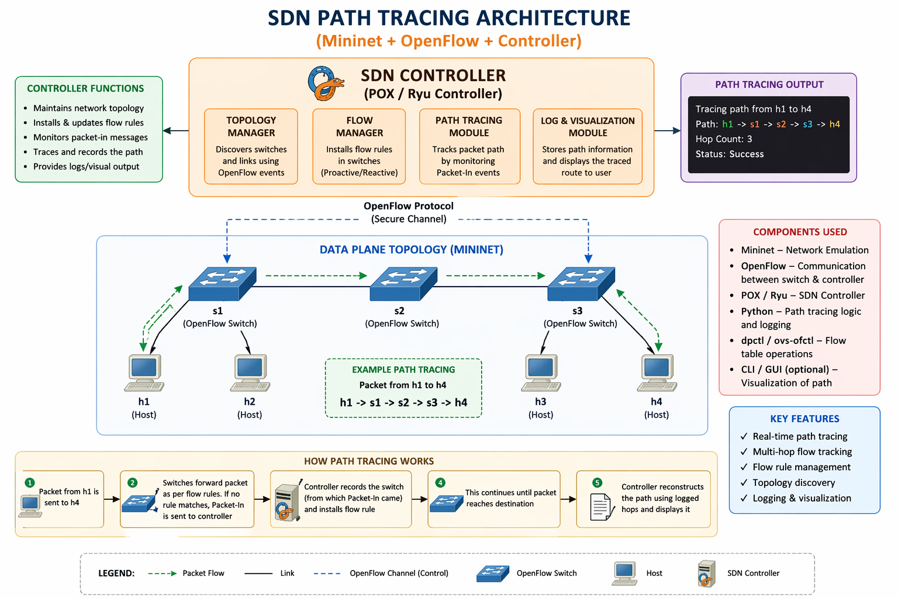

---

## 🎯 Objectives

* Track packet traversal across multiple switches
* Implement match–action rules using OpenFlow
* Develop controller logic to handle `PacketIn` events
* Apply firewall rules to block specific traffic
* Validate behavior using network tests

---

## 🧠 Key Concepts Used

* Software Defined Networking (SDN)
* OpenFlow Protocol
* Controller–Switch Architecture
* PacketIn Event Handling
* Flow Rules (Match–Action)
* Network Monitoring & Logging

---

## 🏗️ Network Topology

A linear multi-switch topology is used:

```
h1 —— s1 —— s2 —— s3 —— h2
               |
               h3
```

### 📌 Justification:

* Multiple switches allow clear **path tracing**
* Supports **multi-hop communication**
* Enables **firewall testing (allowed vs blocked)**

---

## ⚙️ Tools & Technologies

* Mininet (Network Emulator)
* POX Controller (OpenFlow Controller)
* Open vSwitch
* Python

---

## 🚀 Setup and Execution

### 🔷 Step 1: Start POX Controller

```bash
cd ~/pox
./pox.py forwarding.path_tracer
```

---

### 🔷 Step 2: Start Mininet with Fixed MAC Addresses

```bash
sudo mn --topo linear,3 --mac --controller=remote,ip=127.0.0.1,port=6633
```

---

## 🧪 Test Scenarios

### ✅ 1. Allowed Traffic (Normal Case)

```bash
h1 ping h2
h2 ping h3
h3 ping h2
h2 ping h1
```

**Expected Result:**

* Ping successful
* 0% packet loss

---

### ❌ 2. Blocked Traffic (Firewall Case)

```bash
h1 ping h3
h3 ping h1
```

**Expected Result:**

* Ping fails
* Destination unreachable

---

## 📊 Controller Behavior

### 🔹 Packet Handling

* Switch sends unknown packets to controller (`PacketIn`)
* Controller processes and decides forwarding

### 🔹 Path Tracing

* MAC addresses are mapped to switches
* Path is reconstructed dynamically

**Example Output:**

```
PATH TRACE: h1 -> h2 via Switch 1 -> Switch 3
```

---

### 🔹 Firewall Logic

* Specific source–destination pairs are blocked
* Packet is dropped at controller

**Example Output:**

```
BLOCKED: 00:00:00:00:00:01 -> 00:00:00:00:00:03
```

---

## 📈 Performance Observation

### ✔ Latency (Ping)

* Measured using `ping`
* Low latency for allowed traffic

### ✔ Throughput

* Can be tested using `iperf`

### ✔ Flow Behavior

* Dynamic rule installation observed
* Packet forwarding reduces after learning

---

## 📸 Screenshots

### Mininet topology (`nodes`, `net`)

  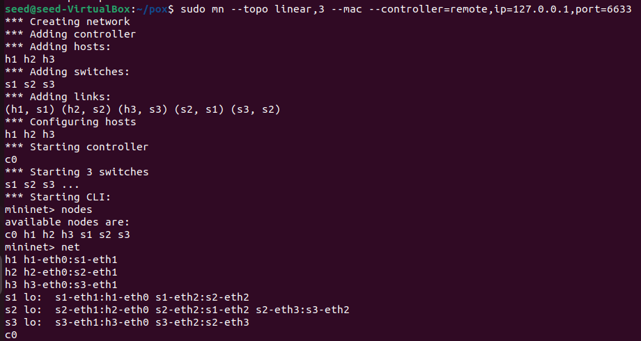
  
### pingall result before firewall rule (0% loss)

  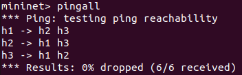

### pingall result after firewall rule (0% loss)

  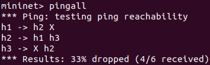
  
### Allowed traffic

  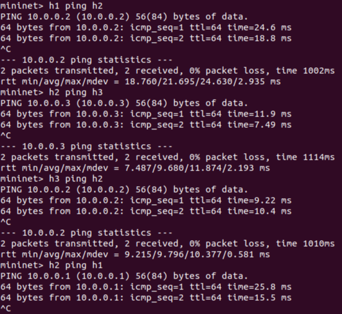
  
### Blocked traffic

  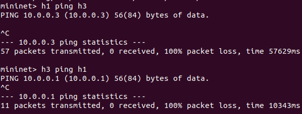

### Starting Controller

  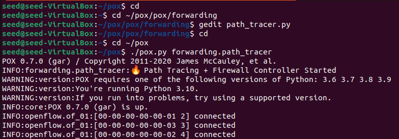

### Controller logs (PATH TRACE + BLOCKED)

  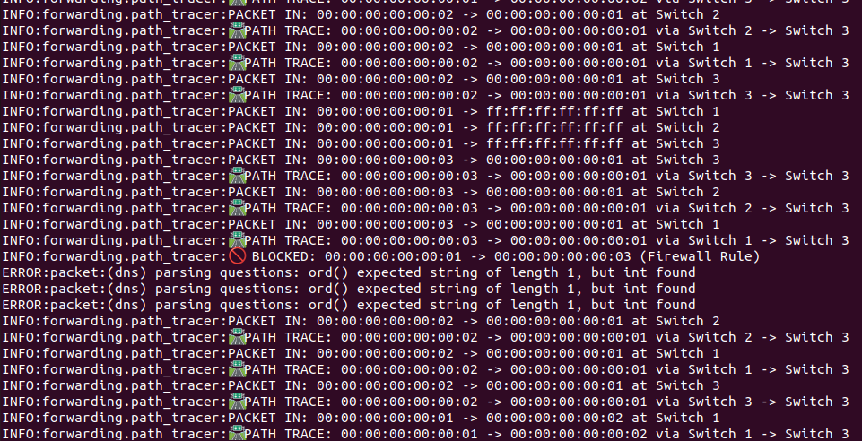

  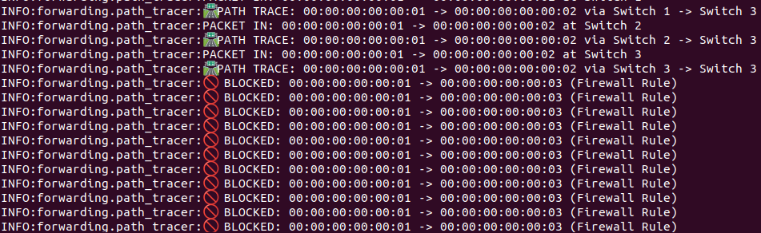

### Throughput
  
  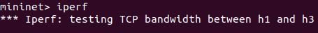

  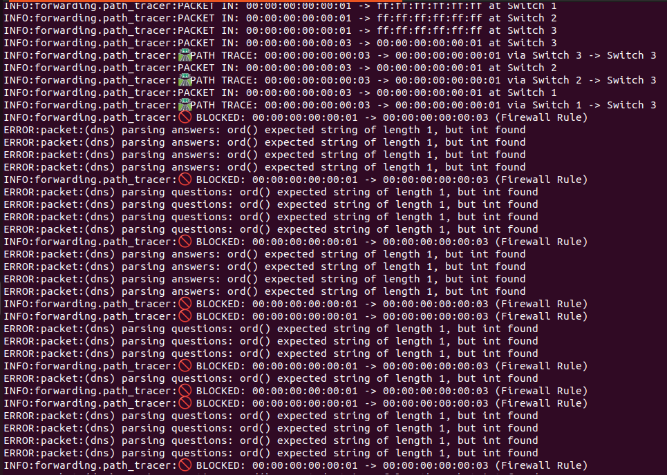

### Flow table

  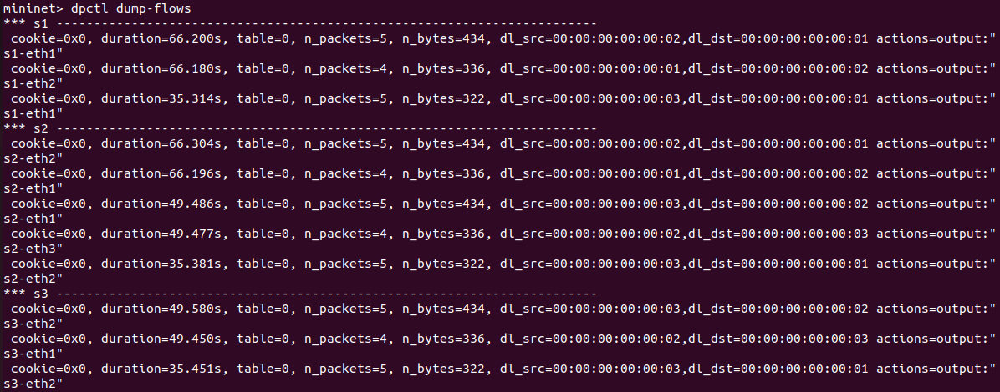
 
---

## ✅ Results

* Successfully traced packet paths across switches
* Implemented firewall rules using SDN controller
* Demonstrated controller-switch interaction
* Validated behavior with test scenarios

---

## 🔍 Validation

* Verified correct forwarding behavior
* Confirmed blocked traffic does not reach destination
* Observed correct path tracing logs
* Firewall rules resulted in controlled packet loss, validating policy enforcement.

---

## 🧠 Conclusion

This project demonstrates how SDN enables:

* Centralized network control
* Flexible traffic management
* Dynamic rule enforcement

The implementation successfully integrates path tracing and firewall mechanisms using OpenFlow.

---

## 📚 References

* Mininet Documentation
* POX Controller Documentation
* OpenFlow Specification

---

## 👨‍💻 By

* Name: *KOTRA SAI SOUMYA SRI*
* SRN: *PES1UG24CS911*
* Class:*4I*
* Subject: *CN*
* Project: SDN Mininet Path Tracing

---
